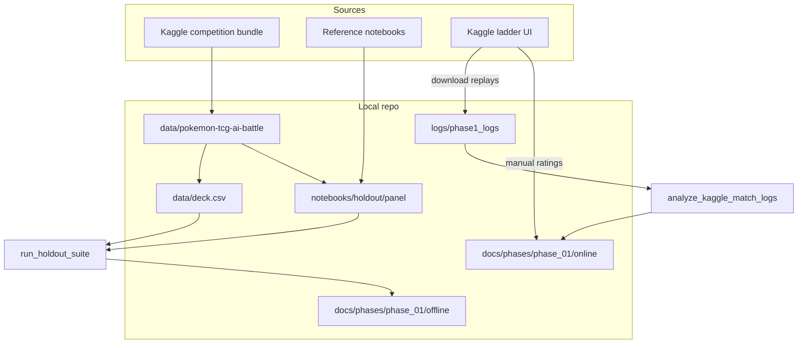

# Data and logs inventory

This document describes every major data and log asset used in the project: what it is, where it came from, where it lives, how it is used, and any preprocessing.

Path resolution for local vs Kaggle is centralized in [`scripts/env_paths.py`](../scripts/env_paths.py).

---

## 1. Official competition bundle

### What type of data?

| Asset | Format | Role |
|-------|--------|------|
| `EN_Card_Data.csv` / `JP_Card_Data.csv` | CSV | Card ID ↔ metadata (EN/JP) for the limited format |
| `Card_ID List_EN.pdf` / `Card_ID List_JP.pdf` | PDF | Human-readable card ID lists |
| `sample_submission/sample_submission/` | Directory | Sample agent (`main.py`), sample `deck.csv` (60 card IDs), and `cg/` SDK |
| `ptcg_engine/` | Directory | Engine packaging / runtime notes for the simulator |

### Origin

- **Source:** [Pokémon TCG AI Battle Challenge](https://kaggle.com/competitions/pokemon-tcg-ai-battle) competition data download on Kaggle.
- **Local placement:** `data/pokemon-tcg-ai-battle/` (gitignored via `data/*`).
- **Kaggle placement:** `/kaggle/input/.../pokemon-tcg-ai-battle/` when the competition dataset is attached.

### How it is placed and used

```
data/
├── .gitkeep
├── deck.csv                    # optional local override (our Dragapult list)
├── extractions/                # optional notebook extraction outputs
└── pokemon-tcg-ai-battle/      # official bundle
    ├── EN_Card_Data.csv
    ├── JP_Card_Data.csv
    ├── Card_ID List_*.pdf
    ├── sample_submission/sample_submission/
    │   ├── main.py
    │   ├── deck.csv
    │   └── cg/                 # cabt Python SDK + native lib
    └── ptcg_engine/
```

- **`cg/` SDK** — imported for local agent runs, holdout battles (`kaggle_environments` + cabt), and packaged into `submission.tar.gz`.
- **Sample `deck.csv`** — fallback deck if `data/deck.csv` is missing; also used as the placeholder list for Crustle/Spidops/Starmie holdout opponents.
- **Card CSVs / PDFs** — reference for card IDs; not currently transformed into a training dataset.

### Processing / preprocessing

- No heavy ETL. Decks are plain newline-separated integer card IDs (exactly **60** lines).
- `load_deck()` (`holdout_runner.py`) strips blank lines and validates length == 60.
- `env_paths.get_paths()` resolves which deck and `cg/` path to use (user override → sample deck).
- macOS only: quarantine may need clearing on `libcg.dylib` before local runs (`xattr`).

---

## 2. Agent deck lists (`deck.csv`)

### What type of data?

- Single-column list of **60 integer card IDs** (Dragapult / water archetype in current Phase 1 work).

### Origin

- Primary research deck (Phase 2+): **Dragapult** at `data/decks/dragapult.csv` (ladder-extracted; synced to `data/deck.csv`).
- Phase 2 alternate candidate: **Starmie** at `data/decks/starmie.csv` (constructed Misty/Mega Starmie list).
- Fallback: official sample at `data/pokemon-tcg-ai-battle/sample_submission/sample_submission/deck.csv`.

### How it is placed and used

| Location | Purpose |
|----------|---------|
| `data/deck.csv` | Preferred local deck (via `env_paths`) |
| Repo-root `deck.csv` | Staged by holdout / packaging; agents also search this path |
| Inside `submission.tar.gz` | Required by Kaggle at package top level |
| `/kaggle_simulations/agent/deck.csv` | Path agents check when running on the ladder |

Agent load order (see `main.py` / baselines):

1. `data/deck.csv`
2. Official sample deck under the competition bundle
3. `deck.csv` (cwd / package root)
4. `/kaggle_simulations/agent/deck.csv`

### Processing / preprocessing

- Parsed as integers; blank lines ignored.
- Holdout wrapper (`wrap_agent`) returns the staged 60-ID list when `obs["select"] is None` (deck-submit step), so agents do not depend solely on disk reads mid-match.

---

## 3. Holdout opponent panel (offline eval)

### What type of data?

Per-opponent directory under `notebooks/holdout/panel/<name>/`:

| File | Type | Role |
|------|------|------|
| `deck.csv` | 60 card IDs | Opponent deck |
| `main.py` | Python agent | Opponent policy |
| `panel_manifest.json` | JSON index | Phase 1 opponent registry |

Fixed archetypes: **Alakazam, Crustle, Spidops, Starmie**.

### Panel versions (do not mix win rates across versions)

| Version | Used in | Crustle / Spidops / Starmie decks |
|---------|---------|-----------------------------------|
| **v1** | Phase 1 canonical offline runs | Official sample `deck.csv` (placeholder) |
| **v2** | Phase 2–4 (complete) | Ladder Crustle; constructed Spidops + Starmie |

Alakazam unchanged across versions. Phase 1 **66.2%** and the pre-fix Phase 2 **38.8%** both measured first-option fallback (`choose()` `UnboundLocalError`). Canonical Phase 2 Dragapult is **83.1%** (repaired policy, panel v2). Do not mix stub and repaired-policy tables.

### Origin (current panel v2 on disk)

| Opponent | Deck origin | Agent origin |
|----------|-------------|--------------|
| **Alakazam** | Meta snapshot notebook payload **B** | Rule-based `main.py` from same payload |
| **Crustle** | Ladder-extracted Dwebble/Crustle list (`panel/crustle/README.txt`) | Random agent |
| **Spidops** | Constructed Team Rocket Tarountula/Spidops list | Random agent |
| **Starmie** | Constructed Misty/Mega Starmie list | Random agent |

Phase 1 canonical JSON was collected on **panel v1** (placeholder Crustle/Spidops/Starmie). See `docs/phases/phase_01/offline/HOLDOUT_LOG.md` vs `docs/phases/phase_02/offline/HOLDOUT_LOG.md`.

Extraction script: [`scripts/extract_holdout_panel.py`](../scripts/extract_holdout_panel.py).

### How it is placed and used

```
notebooks/holdout/
├── panel_manifest.json
└── panel/
    ├── alakazam/{deck.csv, main.py}
    ├── crustle/{deck.csv, main.py, README.txt}
    ├── spidops/{deck.csv, main.py, README.txt}
    └── starmie/{deck.csv, main.py, README.txt}
```

- Consumed by `run_holdout_suite()` → `kaggle_environments.make("cabt", ...)` with our baseline vs each panel opponent.
- CLI: `python scripts/run_phase1_holdout.py --games 40`
- Notebook: `notebooks/PHASE_01_BASELINE_EVAL.ipynb`

### Processing / preprocessing

- Decks: same 60-ID validation as above.
- Agents loaded via `importlib` from `main.py`; cwd set appropriately; `cg` parent on `sys.path`.
- Our deck staged to repo-root / `data/deck.csv` before baseline import.
- Each game: `env.run([our_agent, opp_agent])`; reward from final step for win/loss.
- Results written under `docs/phases/phase_01/offline/results/` (CSV + JSON summary).
- Analysis: `analyze_phase1_results.py` → `HOLDOUT_ANALYSIS.md` (win rates, holdout gate ≥52%).

**Caveat for paper:** only Alakazam is a real rule-based opponent; the other three are directional placeholders.

---

## 4. Offline holdout result artifacts

### What type of data?

| Artifact | Format | Contents |
|----------|--------|----------|
| `phase1_holdout_games_*.csv` | CSV | Per-game rows (baseline, opponent, seed/index, reward) |
| `phase1_holdout_summary_*.csv` | CSV | Per matchup aggregates |
| `phase1_holdout_summary_latest.json` | JSON | Latest summary (wins, games, win_rate, holdout_gate) |
| `HOLDOUT_ANALYSIS.md` | Markdown | Human-readable EDA |

### Origin

Generated locally by `run_phase1_holdout.py` / eval notebook — **not** from Kaggle.

### Placement

`docs/phases/phase_01/offline/results/` (+ `HOLDOUT_ANALYSIS.md` beside them).

### Processing

- Aggregate by baseline × opponent (A / B / Merged).
- Compare deltas: B−A (search), Merged−B (adaptation), Merged−A (full stack).
- Gate flag: `holdout_pass` if win rate ≥ 0.52 else `holdout_fail`.

### Canonical Phase 1 offline KPIs (40×4×3 = 480 games)

| Baseline | Pooled WR | Record | Notes |
|----------|----------:|--------|-------|
| A | 66.2% | 106/160 | no search, no adaptation |
| B | 63.7% | 102/160 | UCB1 only; B−A = −2.5 pp |
| Merged (C) | 41.9% | 67/160 | UCB1 + adaptation; C−B = −21.9 pp |

Source: `docs/phases/phase_01/offline/results/phase1_holdout_summary_latest.json`.
Merged games CSV: `phase1_holdout_games_20260729T132234Z.csv`.

**Panel v1 + first-option stub** — Phase 1 A/B/C did not execute `DragapultPolicy`. Do not compare to repaired Phase 2/3 numbers.

### Phase 2 deck-selection artifacts (panel v2)

| Artifact | Path |
|----------|------|
| Summary JSON | `docs/phases/phase_02/offline/results/phase2_holdout_summary_latest.json` |
| Decision | `docs/phases/phase_02/DECK_SELECTION_DECISION.json` |
| Commitment | `docs/phases/phase_02/DECK_COMMITMENT.json` → `data/deck.csv` |

320 games (Dragapult vs Starmie × 4 opponents × 40). Canonical (repaired policy): Dragapult **83.1%** (133/160) vs Starmie **58.8%** (94/160). Committed deck: **Dragapult**. Pre-fix 38.8%/54.4% is superseded.

### Phase 3 ablation artifacts (panel v2 — canonical V1–V4)

| Artifact | Format | Contents |
|----------|--------|----------|
| `phase3_holdout_games_*.csv` | CSV | Per-game rows (version, opponent, reward) |
| `phase3_holdout_summary_*.csv` | CSV | Per-matchup aggregates |
| `phase3_holdout_summary_latest.json` | JSON | Latest V1–V4 summary |
| `PHASE_03_RESULTS.json` | JSON | Machine-readable findings + contrasts |
| `HOLDOUT_ANALYSIS.md` | Markdown | Paper Table 1 source |

CLI: `scripts/run_phase3_holdout.py` · `scripts/analyze_phase3_results.py`

**640 games** (V1–V4 × 4 opponents × 40). Deck: committed Dragapult.

| Version | Pooled WR | Record | Search | Adaptation |
|---------|----------:|--------|:------:|:----------:|
| V1 | **90.0%** | 144/160 | ✗ | ✗ |
| V2 | 36.2% | 58/160 | ✓ | ✗ |
| V3 | 85.0% | 136/160 | ✗ | ✓ |
| V4 | 34.4% | 55/160 | ✓ | ✓ |

Key contrasts (pp): V2−V1 **−53.8**; V3−V1 **−5.0**; V4−V1 **−55.6**. V1 strongest offline. `choose_fail=0`; search actually ran on V2/V4. Pre-fix 40.0/32.5/36.2/34.4% table is first-option noise — superseded.

Source: `docs/phases/phase_03/offline/results/phase3_holdout_summary_latest.json` · `docs/phases/phase_03/PHASE_03_RESULTS.json`.

### Phase 4 search-depth artifacts (panel v2 — complete)

| Artifact | Format | Contents |
|----------|--------|----------|
| `phase4_holdout_games_*.csv` | CSV | Per-game rows (cell, candidates, time, opponent, reward) |
| `phase4_holdout_summary_*.csv` | CSV | Per-matchup aggregates |
| `phase4_holdout_summary_latest.json` | JSON | Latest cell summaries |
| `PHASE_04_RESULTS.json` | JSON | Curves, knee, findings |

CLI: `scripts/run_phase4_holdout.py` · `scripts/analyze_phase4_results.py`

Agent: V2 only. 7 cells × 160 games. Best: 4 candidates / 1.5 s at **57.5%** (−32.5 pp vs V1). Time knee 0.5 s; candidate knee 4. `choose_fail=0`.

## 5. Online Kaggle ladder logs (replays)

### What type of data?

Kaggle **episode replay JSON** for a single ladder match.

Typical main file fields:

| Field | Meaning |
|-------|---------|
| `info.EpisodeId` | Match / episode ID |
| `info.Agents` / `TeamNames` | Display names (often your username on both seats) |
| `rewards` | `[r0, r1]` — `1` win, `-1` loss per seat |
| `steps` | List of timesteps; each step is `[player0_view, player1_view]` |
| Per-view | `action`, `observation`, `reward`, `status`, `visualize` |

Observations include board state (`current.players`), hand counts, deck counts, logs, select options. Opponent **hand card IDs** stay hidden; deck list is visible at the deck-submit action (length 60).

Optional companion files (if downloaded): `<episode>-0.json` / `<episode>-1.json` — per-agent call timing (`duration`, `stdout`, `stderr`) only; not required for win/loss or board EDA.

### Origin

- **Source:** Kaggle competition UI — download episode / replay after ladder matches for your submissions (Baseline A / B / Merged).
- **Not** produced by local holdout.
- Ladder **ratings** (e.g. 433 / 612) come from the UI and are entered manually into analysis (`--rating baseline_a=433`); they are **not** inside the JSON.

### How it is placed and used

```
logs/phase1_logs/                    # gitignored (logs/)
├── baseline_a/
│   ├── won/<episode_id>.json
│   └── lost/<episode_id>.json
├── baseline_b/
│   ├── won/<episode_id>.json
│   └── lost/<episode_id>.json
└── baseline_merged/                 # add when Merged replays downloaded
    ├── won/<episode_id>.json
    └── lost/<episode_id>.json
```

- Folder `won` / `lost` is a human label for your outcome; the analyzer re-checks via `info.Agents[].Name == "Muhammad Faheem"`, then Dragapult IDs `{119,120,121}`, then `rewards[our_player]`. Sample-water IDs `{721,722,723}` must not be used to identify us (they match opponents).
- Analyzer: `python scripts/analyze_kaggle_match_logs.py --rating baseline_a=507 --rating baseline_b=507`
- Docs / outputs: `docs/phases/phase_01/online/` (`KAGGLE_LOG.md`, `KAGGLE_ANALYSIS.md`, `results/kaggle_log_analysis.json`)

### Processing / preprocessing

1. Load each JSON under `logs/phase1_logs/`.
2. Infer **our player slot** from `info.Agents[].Name == "Muhammad Faheem"`, else Dragapult IDs `{119,120,121}` on the length-60 deck-submit action (never sample-water `{721,722,723}`).
3. Outcome = `rewards[our_player] == 1`.
4. Extract game length (steps), decision counts, hand-size ranges, board-visible opponent card IDs.
5. Classify opponent deck by overlap with holdout panel signatures (`alakazam`, `crustle`, …) or label `other_N_types`.
6. Write markdown + JSON EDA.

**Not available in logs:** opponent username, submission ID, full hidden hand, ladder Elo series (manual).

---

## 6. Reference notebooks (local resources)

### What type of data?

Public / competition-related Jupyter notebooks used as source material for policy, search, and meta decks.

### Origin

Downloaded/copied into `docs/resources/reference_notebooks/` (gitignored under `docs/resources/`). Examples:

- Dragapult rule-based sample
- Improved probabilistic / Expectimax + search
- Meta snapshot (07 July) — Alakazam payload B for holdout

### How used

- `build_merged_agent.py` stitches policy + search + opponent hooks into baseline/merged agents.
- `extract_holdout_panel.py` pulls Alakazam deck + agent from the meta notebook.

### Processing

- Notebook cells parsed as JSON; selected code cells `exec`’d or string-extracted.
- No ML feature pipeline — source-code and deck-list extraction only.

---

## 7. cabt documentation mirror

### What type of data?

Offline HTML / Markdown / SDK snapshot of the cabt simulator docs.

### Origin

Mirrored from the public cabt documentation site into `docs/resources/cabt/` (gitignored). Index: [`CABT_DOCS_INDEX.md`](CABT_DOCS_INDEX.md).

### How used

Local API reference for Search / Observation / game loop — not training data.

---

## 8. Generated agent code and submissions

### What type of data?

| Asset | Role |
|-------|------|
| `notebooks/agents/main_baseline_a.py` | Phase 1 A — no search |
| `notebooks/agents/main_baseline_b.py` | Phase 1 B — UCB1 search |
| `notebooks/agents/main_baseline_merged.py` | Phase 1 C — search + adaptation |
| `notebooks/merged_agent_main.py` / `main.py` | Full / active entry agent (same flags as merged) |
| `submission.tar.gz` | Packaged `main.py` + `deck.csv` + `cg/` for Kaggle upload |

### Origin

Built from reference notebooks via `build_merged_agent.py` / workbench notebook.

### Processing

- Feature flags (`USE_SEARCH`, `USE_OPPONENT_ADAPTATION`) toggled per baseline.
- Packaging copies active deck and `cg/` into a tarball (gitignored).

---

## 9. End-to-end data flow (Phase 1)



---

## 10. Gitignore vs tracked

| Tracked in git | Local-only (gitignored) |
|----------------|-------------------------|
| Agent sources, notebooks, docs under `docs/phases/` | `data/pokemon-tcg-ai-battle/`, `data/deck.csv`, `data/extractions/` |
| Holdout panel decks/agents (small CSVs + py) | `logs/` (all ladder JSON) |
| Analysis markdown/JSON under `docs/phases/.../results/` (if committed) | `docs/resources/`, `submission.tar.gz`, `cg/` at repo root |

---

## 11. Quick reference — which script touches what?

| Script / notebook | Reads | Writes |
|-------------------|-------|--------|
| `scripts/env_paths.py` | Competition bundle, decks | — (resolves paths) |
| `scripts/extract_holdout_panel.py` | Meta notebook, sample deck | `notebooks/holdout/panel/` |
| `scripts/build_merged_agent.py` | Reference notebooks | `notebooks/agents/`, `merged_agent_main.py`, `main.py` |
| `scripts/run_phase1_holdout.py` | Baselines, panel, deck, `cg` | `docs/phases/phase_01/offline/results/` |
| `scripts/analyze_phase1_results.py` | Holdout summary JSON | `offline/HOLDOUT_ANALYSIS.md` |
| `scripts/run_phase2_holdout.py` | Dragapult/Starmie decks, panel v2 | `docs/phases/phase_02/offline/results/` |
| `scripts/analyze_phase2_results.py` | Phase 2 summary + meta snapshot | `DECK_SELECTION_DECISION.json`, `HOLDOUT_ANALYSIS.md` |
| `scripts/run_phase3_holdout.py` | V1–V4 agents, Dragapult deck, panel v2 | `docs/phases/phase_03/offline/results/` |
| `scripts/analyze_phase3_results.py` | Phase 3 summary JSON | `PHASE_03_RESULTS.json`, `HOLDOUT_ANALYSIS.md` |
| `scripts/run_phase4_holdout.py` | V2 agent, Dragapult, panel v2, search env | `docs/phases/phase_04/offline/results/` |
| `scripts/analyze_phase4_results.py` | Phase 4 summary JSON | `PHASE_04_RESULTS.json`, `HOLDOUT_ANALYSIS.md` |
| `scripts/analyze_kaggle_match_logs.py` | `logs/phase1_logs/`, panel decks | `online/KAGGLE_ANALYSIS.md`, `online/results/` |
| Workbench `build_submission()` | `main.py`, deck, `cg` | `submission.tar.gz` |
